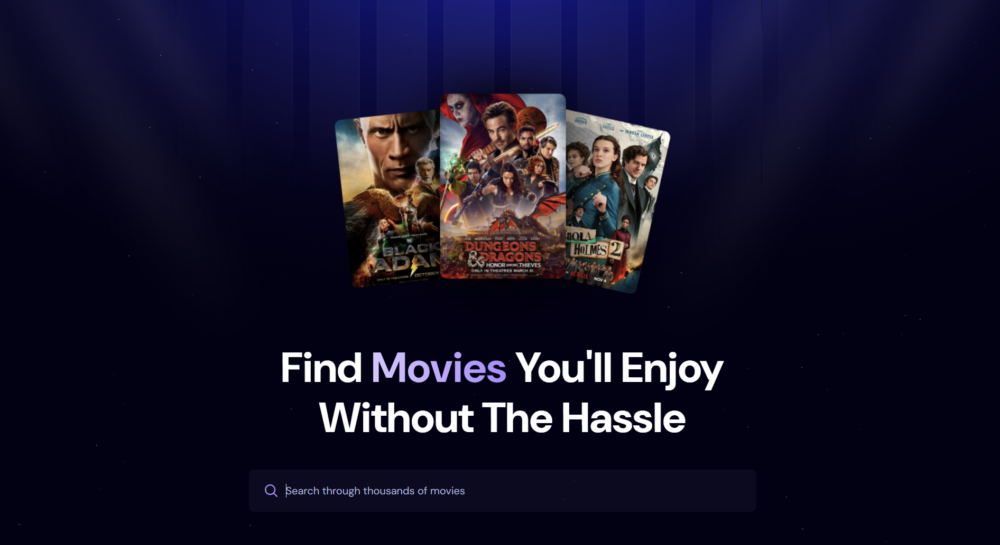

# 🎬 MovieFinder

A sleek and responsive movie discovery app that lets users explore trending and latest movies, powered by **TMDB API** and backed by **Appwrite**. Built using **React.js** and styled with **Tailwind CSS**, this project features real-time search with **debouncing** and user-driven trending movie tracking.

---

## ✨ Features

- 🔥 **Trending Movies**: Lists the most popular and latest movies.
- 🔎 **Search Functionality**: Search for your favorite movies with real-time results.
- 🧠 **Debounced Search**: Efficient searching using debouncing to minimize API calls.
- 📈 **Search Tracking**: User searches are tracked and stored in Appwrite to dynamically update trending results.
- 💡 **Clean & Modern UI**: Built with Tailwind CSS for a responsive, mobile-friendly experience.

---

## 🛠️ Tech Stack

### Frontend
- ⚛️ React.js
- 🎨 Tailwind CSS

### Backend / APIs
- 🧰 [Appwrite](https://appwrite.io/) – for search tracking & data storage
- 🎞️ [TMDB API](https://www.themoviedb.org/documentation/api) – for fetching movie data

---

## 🚀 Getting Started

### 1. Clone the Repository
```bash
git clone https://github.com/yourusername/moviefinder.git
cd moviefinder
````

### 2. Install Dependencies

```bash
npm install
```

### 3. Setup Environment Variables

Create a `.env` file in the root directory and add the following:

```env
VITE_TMDB_API_KEY=your_tmdb_api_key
VITE_APPWRITE_PROJECT_ID=your_appwrite_project_id
VITE_APPWRITE_DATABASE_ID=your_database_id
VITE_APPWRITE_COLLECTION_ID=your_collection_id
```

### 4. Run the App

```bash
npm run dev
```

---

## 📁 Folder Structure

```
src/
├── components/         # Reusable UI components like Search, Spinner, MovieCard
├── assets/             # Images and icons
├── App.jsx             # Main application file
├── appwrite.js         # Appwrite integration logic
└── main.jsx            # Entry point
```

---

## 📸 Screenshots

| Home Page                       | Search Result                       |
| ------------------------------- | ----------------------------------- |
|  |  |

---

## 🧠 Future Enhancements

* 🎥 Add movie detail pages with cast, trailers, and reviews.
* 🧾 Pagination for search results.
* 📊 Analytics dashboard for top searched movies.

---


## 🙌 Acknowledgements

* [TMDB](https://www.themoviedb.org/) for the amazing movie database.
* [Appwrite](https://appwrite.io/) for powerful backend tools.
* [Tailwind CSS](https://tailwindcss.com/) for utility-first styling.

---

## 🤝 Contributing

Contributions are welcome! Please fork the repo and submit a pull request.


